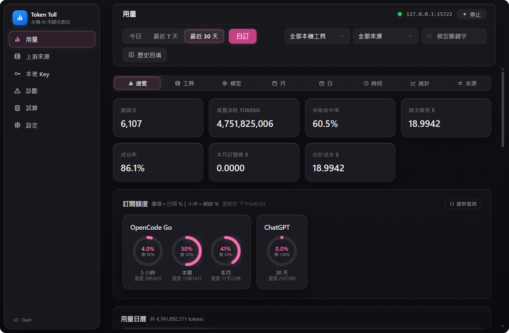
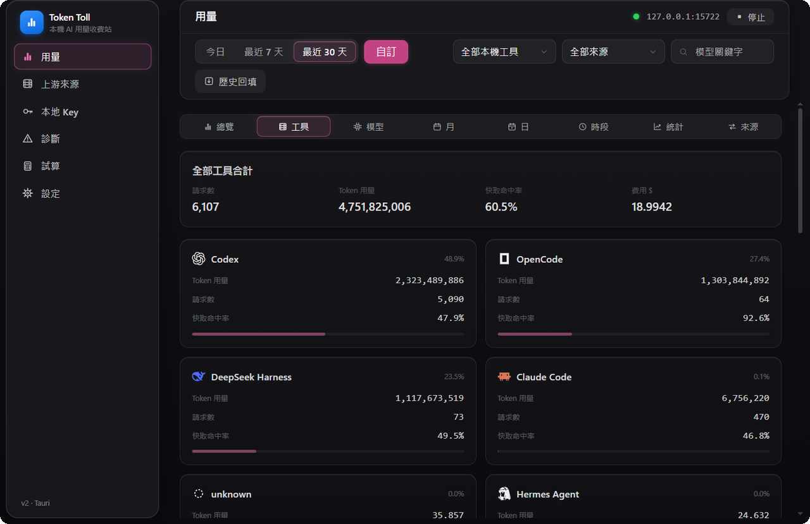
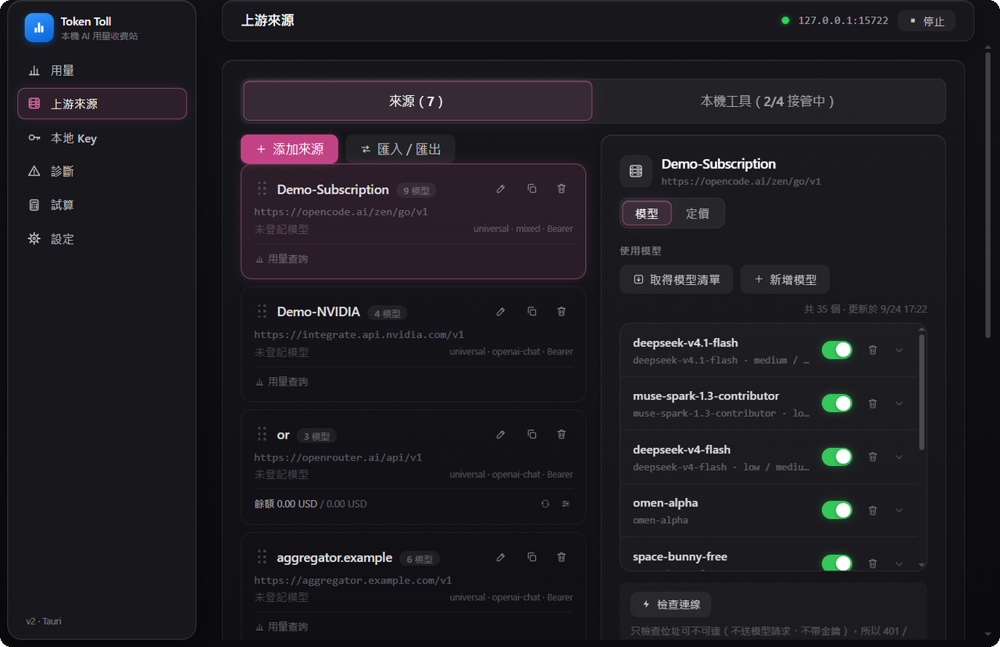
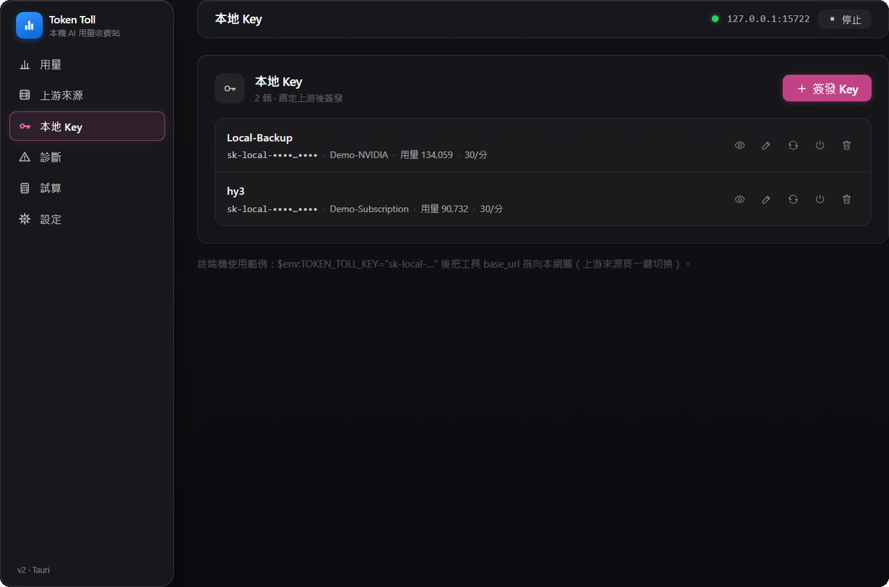
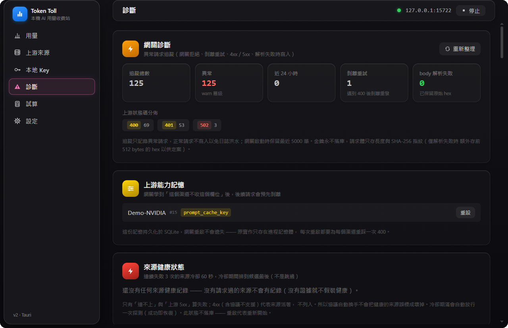
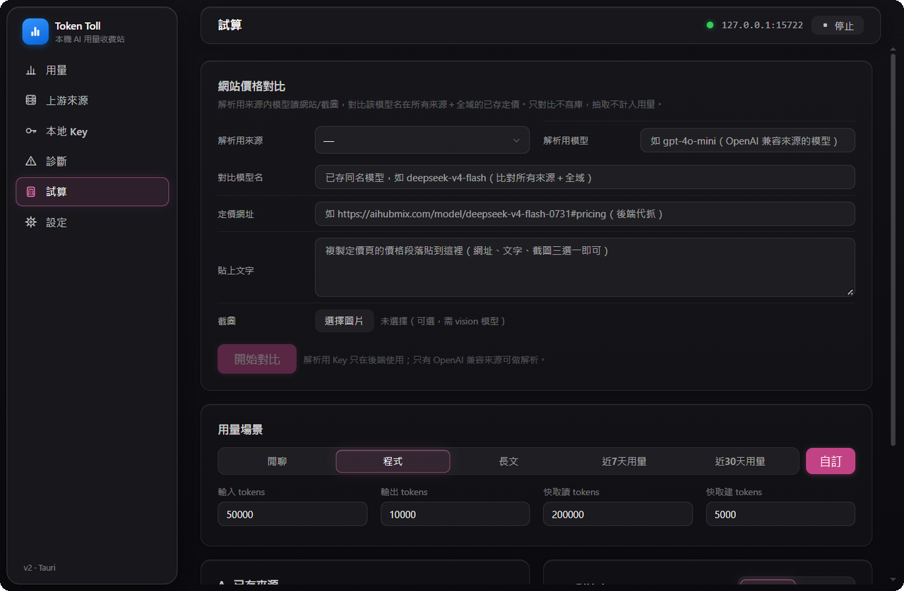
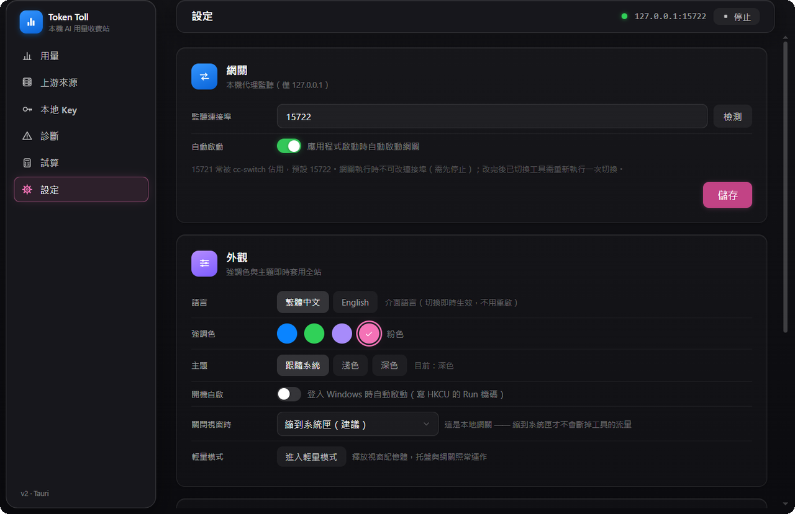

# Token Toll · 本機 AI 用量收費站

> Your local AI toll booth — meter, route, and account for every token your coding agents spend.
>
> 本機 AI 用量收費站（Windows）：把多個上游聚合成一個 OpenAI 兼容入口、按工具簽發本地 Key、每一分錢燒在哪裡都看得見。

[](./LICENSE)
[](#下載--download)
[](https://tauri.app)
[](#專案狀態--project-status)
[](#資料與隱私--data--privacy)

---

## 這是什麼 · What it is

你在同一台機器上跑 Codex、Claude Code、OpenCode 等工具，每個都要自己填上游網址與金鑰，額度、限流、花了多少錢散在各處，沒有一個地方看得全。

Token Toll 在本機 (`127.0.0.1`) 開一個 OpenAI／Anthropic／Gemini 兼容的入口：車輛過收費站要計費，token 過閘道要計量——把多個上游聚合成一個端點，替每個工具簽發獨立的本地 Key（各自配額、限流、模型白名單），攔下每一次請求做精確計量與計價，並把各工具的歷史會話用量一併補登進同一本帳。

**全部資料留在本機 SQLite，不經過任何第三方伺服器。** 網關只監聽 `127.0.0.1`，不對外開放。

---

## 畫面 · Screenshots

> 以下皆為實際執行畫面（Windows 11、深色模式、預設藍色 Accent）。
> 為保護隱私，來源名稱與本地 Key 已置換為展示用名稱。

### 用量總覽

貢獻日曆、Token 趨勢、成本趨勢，7 張統計卡一眼看完。



### 用量 → 工具視角

分工具的堆疊柱狀圖，滑過去看該時間桶的請求數、費用與各工具佔比。



### 上游來源

多個上游聚合成一個端點，各自獨立金鑰、協議、模型目錄與定價。



### 本地 Key

按工具簽發 `sk-local-…`，各自配額、限流（QPM）、模型白名單。



### 診斷中心

來源健康、斷路器狀態、協議記憶、歷史回填，全部看得見。



### 試算比價

按量 vs 訂閱，閒聊／程式／長文三種場景比價。



### 設定

網關埠（預設 15722）、外觀 Accent、開機自啟、語言。



---

## 功能 · Features

### 用量 · Usage（8 個視角）

| 視角 | 內容 |
|---|---|
| 總覽 | GitHub 式貢獻日曆 ＋ Token 趨勢 ＋ 成本趨勢 |
| 工具 | 逐工具拆分（唯一能並排比較各工具來源的視角） |
| 模型 | 模型排行、快取命中率、成本 |
| 月 / 日 / 時段 | 按月、按日、按小時聚合 |
| 統計 | 成功率、延遲、快取讀寫比 |
| 來源 | 逐上游渠道拆分 |

- **Usage analytics (8 lenses)**: Overview (contribution calendar + token/cost trend), Tools, Models, Monthly, Daily, Hourly, Stats, Channels
- 時間範圍：今日 / 最近 7 天 / 最近 30 天（底層另支援 90／180／365 天查詢）
- **歷史導入**：掃描各工具本地會話記錄補登用量（Claude／Codex／OpenCode／DeepSeek Harness）
- 注意：整體快取命中率**不可**由「工具」視角的各行自行平均（各工具 token 量差距極大，實測可差 19.7 個百分點）——需要整體數字請看總覽

### 上游來源 · Providers

- **5 種介面格式**：`openai-chat`、`openai-responses`、`mixed`、`anthropic`、`gemini`（相容性矩陣見下）
- **3 種鑑權**：`bearer`、`goog-key`、`anthropic`
- **38 組來源預設集**：`base_url` 逐筆實測過（對 `{base_url}/models` 送不帶金鑰的 GET，只有 DNS 失敗／逾時／410 才淘汰；Ollama／LM Studio 兩個本機服務因未安裝而**未實測**，備註欄如實標示）
- **模型映射 ＋ 四率定價**：輸入／輸出／快取讀／快取建，另支援**時段定價**與**訂閱費抵扣**
- **一鍵取得模型清單**：直接對上游抓 `/models`（不在預設裡猜模型名——猜錯比不填更糟）
- **來源連線檢查**與健康度（連續失敗的來源會被排到候選佇列最後，但一個都不丟）

- **Upstream management**: 5 API formats, 3 auth schemes, 38 empirically-verified presets, model mapping + 4-rate pricing, time-window pricing and subscription-fee offsets

### 本地 Key · Keys

- 每個工具一把 `sk-local-…` Key，可獨立設定**配額、限流（QPM）、模型白名單、工具白名單、到期日**
- 明文**只顯示一次**，可輪替、可停用；之後只看得到前後綴

- **Local key issuance**: one `sk-local-` key per tool with its own quota, rate limit, model/tool allowlists and expiry; plaintext shown once, rotatable and revocable

### 診斷中心 · Diagnostics

- **請求追蹤**（`proxy_trace`）：逐筆記錄入站格式、渠道協議、翻譯種類、上游狀態、延遲、重試次數
- **上游拒收欄位記憶**：上游回 400 說某欄位不支援 → 記住並自動剝離後重試（落庫，重啟不遺忘）
- **協議記憶**：逐模型記住「這個來源的這個模型該用哪個端點」
- **來源健康**：斷路器狀態、協議分佈、模型清單

### 試算比價 · Calc

- A／B 雙來源同條件試算，自動標出更便宜的一方
- **網站價格對比**：貼定價頁**網址／文字／截圖**，AI 抽取價格並與全庫同名定價逐行對比、可按價格排序

### 設定 · Settings

網關連接埠與自動啟動、外觀（System／Light／Dark ＋ **4 種強調色**，偏好存 SQLite）、介面語言（繁中／English，切換即時生效）、**用量匯出 CSV**（Excel 直開）、關於。

來源**列表**也有匯出／匯入／複製（只碰來源、模型與定價，不含用量紀錄）。

### 工具接管 · Tool takeover

一鍵把工具配置指向網關，**改寫前自動備份**，可一鍵還原：

| 工具 | 接管 | 用量歸屬 |
|---|---|---|
| Claude Code | ✅ | ✅ |
| Codex | ✅（含接管前體檢） | ✅ |
| OpenCode | ✅ | ✅ |
| Hermes Agent | — | ✅ |
| DeepSeek Harness | — | ✅ |
| Cursor | — | ✅ |
| Antigravity | — | ✅ |

- 可與 [CC Switch](https://github.com/farion1231/cc-switch) 共存；連接埠衝突會明確指出佔用者
- 改寫 `~/.codex` 等設定檔時**保留註解與無關段落**

- **One-click takeover**: backs up and rewrites Codex / Claude Code / OpenCode configs, one-click rollback, comments and unrelated sections preserved

### 介面 · UI

macOS 27 風格的介面：Liquid Glass、深／淺／跟隨系統三種主題、4 種強調色、支援 600px 窄窗、**6 個主頁籤**（用量／上游來源／本地 Key／診斷／試算／設定）。

應用程式圖示同樣是 macOS 級圓角（超橢圓 n=4，≈ Apple 22.4% 圓角率）的霧面 Liquid Glass 設計，四角透明。

---

## 介面格式與相容性 · API formats & compatibility

「格式」是**渠道端**的協議。能不能用，取決於**你用什麼客戶端**打什麼渠道——以下是完整的 4×5 矩陣（程式碼中連同「未知」軸共 30 格全列舉，無萬用字元）：

| 客戶端 ↓ ＼ 渠道格式 → | `openai-chat` | `openai-responses` | `mixed` | `anthropic` | `gemini` |
|---|---|---|---|---|---|
| **OpenAI Chat** | ✅ 直通 | ❌ 明確拒絕 | ✅ 直通 | ❌ 未實現 | ❌ 只收 Gemini |
| **Responses**（Codex） | ✅ 自動翻譯 | ✅ 直通 | ✅ 直通 | ❌ 未實現 | ❌ |
| **Anthropic**（Claude Code） | ✅ 自動翻譯 | ❌ | ✅ 自動翻譯 | ✅ 直通 | ❌ |
| **Gemini 原生** | ❌ | ❌ | ❌ | ❌ | ✅ 直通 |

### `mixed` 是什麼

`mixed` 不是一種真實的上游協議，它的意思是「**這個來源的 `/chat/completions` 與 `/responses` 都有架**」。因為上游常常**逐模型**只開一端（實測 opencode-go：`grok-4.7` 只在 `/responses`、`mimo-v2.6` 只在 `/chat/completions`、`deepseek-*` 兩邊都有），`mixed` 搭配自動換手可以讓你不必事先知道每個模型走哪端：

1. 先樂觀直通（Responses 請求打 `/responses`，Chat 請求打 `/chat/completions`）
2. 上游若回 `400 ModelProtocolUnsupported` → **換協議重試**（`mixed` → `openai-chat` / `openai-responses`）
3. 成功後把「這個來源的這個模型該用哪個協議」**落庫**，下次第一個就試它（網關重啟不遺忘）

> ⚠️ **代價**：每個「來源 × 模型」組合的**第一次**請求必然多付一次失敗探測（一個 400）。這是樂觀直通的本質，不是 bug。

> ⚠️ **`mixed` 仍受客戶端限制**：Claude Code（Anthropic 入站）只生得出 chat 請求體（沒有 Anthropic→Responses 翻譯器），所以 **responses-only 的模型在 Claude Code 下永遠換不過去**。

### 其他限制

- **`gemini` 渠道是雙向鎖死的**：Gemini 原生請求只能走 gemini 渠道，gemini 渠道也只收 Gemini 原生——不能拿它餵 Claude Code 或 Codex
- **`anthropic` 渠道幾乎專用於 Claude Code**：Codex（Responses）打過去會得到「反向轉換尚未實現」
- **`openai-responses` 渠道會明確拒絕 chat 請求**（而非靜默失敗）

---

## 快速開始 · Quick Start

1. 啟動 App，頂欄按 **啟動**（預設監聽 `127.0.0.1:15722`，僅本機）
2. **上游來源** → 新增來源（或從 38 組預設挑）→ 填 `base_url` ＋ Key → 登記模型與定價
3. **本地 Key** → 簽發 Key → 綁定來源（可選配額／限流／模型白名單）
4. 把工具的 `base_url` 指到 `http://127.0.0.1:15722/v1`、Key 填剛簽發的 `sk-local-…`（或用**工具接管**一鍵完成）
5. 回到 **用量** 看即時統計

1. Launch, hit **啟動** in the top bar (listens on `127.0.0.1:15722`, localhost only)
2. **Providers** → add one (or pick from 38 presets) → `base_url` + key → register models + pricing
3. **Keys** → issue a key → bind a provider (optional quota / rate limit / allowlists)
4. Point your tool at `http://127.0.0.1:15722/v1` with the `sk-local-…` key (or use one-click takeover)
5. Watch live stats under **用量**

---

## 下載 · Download

### 最新版本 · v0.1.1

**[⬇ 前往 Releases 頁下載](https://github.com/aaaeeezynx/tokentoll/releases/latest)**

| 檔案 | 大小 | 說明 |
|---|---|---|
| [`Token Toll_0.1.1_x64-setup.exe`](https://github.com/aaaeeezynx/tokentoll/releases/download/v0.1.1/Token.Toll_0.1.1_x64-setup.exe) | 3.9 MB | **NSIS 安裝包（推薦）**，雙擊安裝 |
| [`Token Toll_0.1.1_x64_en-US.msi`](https://github.com/aaaeeezynx/tokentoll/releases/download/v0.1.1/Token.Toll_0.1.1_x64_en-US.msi) | 8.2 MB | MSI 安裝包，適合企業佈署 |

> 版本號 `0.1.1` 在 `Cargo.toml`／`tauri.conf.json`／`package.json` 三者一致。

**系統需求**：Windows 10 1809+ / Windows 11（x64）· WebView2 Runtime（Win10／11 一般自帶）

> **未簽名版本**：SmartScreen 會提示「未知的發行者」，選「仍要執行」即可。
> 想自行核對檔案完整性，SHA256 校驗碼寫在 Release 說明裡。

> **Latest release: v0.1.1.** Unsigned build: SmartScreen will warn about an
> unknown publisher — choose "Run anyway". Requires WebView2 Runtime.

---

## v0.1.1 修復 · What's fixed

### 1. 換協議撞到 404 被誤學成「協議會通」→ 永久 404

**症狀**：某些模型（實測 NIM 的 `moonshotai/kimi-k3`、`z-ai/glm-5.3`）一直回
`404 page not found`，重試也一樣。

**原因**：上游跑太久自己回 504 之後，網關會換到另一個協議重試；若那個端點上游
根本沒有就是 404。舊版把**任何非 400 的回應**都當成成功，於是那個 404 被寫進
「協議記憶」並在下一輪被排到第一位 —— 永久 404，而且每次失敗都再學一次同樣的錯誤。

**修正**：只有真正 2xx 才寫入協議記憶；404／405 視為「端點不存在」，換手且不學。
逾時／上游故障的訊息會優先呈現（你看到的是 504，不再是沒有訊息量的 404）。
換手功能本身不變：模型真的在另一邊時照樣成功並記住。

### 2. Codex 模型目錄模板自癒（不再依賴 cc-switch）

**症狀**：在**第一次安裝**、從沒裝過 cc-switch 的機器上，接管 Codex 時失敗：
「找不到模型目錄模板…請先跑一次 `codex debug models --bundled` 導出」。

**原因**：模板原本只能靠「收編 cc-switch 的遺留檔」產生；而那句錯誤訊息叫你跑的
指令**只印到 stdout、不寫任何檔案**，照著做也生不出網關要找的那個檔。

**修正**：找不到模板時，網關**自己**呼叫 `codex debug models --bundled` 取得內建
目錄當模板（依序找 PATH 上的 `codex.exe`、Codex **桌面版**的 `codex.exe`、npm shim
`codex.cmd`）。錯誤訊息也改成兩條真的可行的解法。

### 3. 修掉外部指令的 pipe 死結

**症狀**：輸出量大的外部指令會「永遠逾時」。

**原因**：舊版等到行程結束才讀 pipe，而 pipe 緩衝區只有 ~64 KB —— 輸出超過就會
把它寫滿而阻塞。

**修正**：先開執行緒把兩條 pipe 讀完再等行程。Codex 的 658 KB 匯出從
**30 秒逾時**變成 **0.25 秒**。

### 4. 上下文視窗改成下拉選單，預設 256K

模型的上下文視窗未填時，原本會繼承模板寫死的 **1,000,000**，讓 Codex 以為有
100 萬 token 可用而遲不壓縮，把請求堆到上游直接 400（實測出現過 937 KB／2.3 MB／
25 MB 的請求體）。

現在它是下拉選單：**32K / 64K / 128K / 200K / 256K（預設）/ 512K / 1M / 2M**，
另備「自訂…」與「不指定」；未填時寫 **256K**，不再繼承 1M。

---

## 從源碼構建 · Build from Source

**依賴**：Node ≥ 22（pnpm）、Rust stable、Windows x64

```sh
pnpm install
pnpm tauri dev      # 開發運行 · dev run
pnpm tauri build    # 打包 · packaging
```

- 前端型別檢查與打包：`pnpm build`（`tsc && vite build`）
- 後端測試：`cargo test --manifest-path src-tauri/Cargo.toml --offline --lib`
- Lint：`cargo clippy --manifest-path src-tauri/Cargo.toml --all-targets -- -D warnings`
- 打包 Windows 安裝包需 `makensis`（NSIS 3）與 `candle.exe`／`light.exe`（WiX 3）在 `PATH`；無管理員權限可用兩者的便攜 zip 解壓後加入 PATH
- 產物：`src-tauri/target/release/bundle/{nsis,msi}/`

- Frontend: `pnpm build` (`tsc && vite build`) / backend: `cargo test --offline --lib`
- Windows packaging needs `makensis` (NSIS 3) and WiX 3 on `PATH`
- Bundles land in `src-tauri/target/release/bundle/`

---

## 資料與隱私 · Data & privacy

| 項目 | 位置 |
|---|---|
| 資料庫 | `%APPDATA%\com.tokencounter.gateway\app.db`（SQLite，WAL） |
| 工具設定備份 | `<app_data>\backups\<工具>\`（接管前的 baseline，改寫前自動建立） |

- 網關**只監聽 `127.0.0.1`**，不對外開放；沒有雲端同步、沒有遙測
- 上游金鑰存本機 SQLite；本地 Key 明文只在簽發當下顯示一次
- 移除任何功能時**不會動你工具本身的設定檔**——移除的是本 App 的管理能力，不是你的檔案
- **All data stays local.** No cloud sync, no telemetry. The gateway binds to `127.0.0.1` only.

---

## 常見問題 · FAQ

- **啟動失敗／連接埠被佔用？** 預設 `15722`。若與 CC Switch 等工具衝突，App 會明確指出佔用者，換埠或先停掉對方。
- **歷史用量是空的？** 用用量頁的導入功能掃描各工具本地會話記錄補登。注意有些工具（如 DSH）若設定為直連上游、不經過網關，就不會出現在統計裡。
- **定價對不上？** 先檢查來源定價的時段／訂閱抵扣，再用試算頁的網站價格對比抓差異。
- **某個模型一直 400「不支援本協議」？** 上游多半是逐模型開端點。把渠道格式改成 `mixed` 讓它自動換協議，或直接在來源的模型清單裡調整。
- **Port in use?** Default `15722`; on conflict the app names the occupant.
- **Empty history?** Use the import function on the Usage page to backfill from local session logs.
- **Pricing mismatch?** Check time-window pricing / subscription offsets first, then diff with the website price check.

---

## 已知限制 · Known limitations

誠實列出，不藏：

- **僅 Windows x64**：協定註冊、接管路徑、打包都針對 Windows
- **未簽章**：沒有程式碼簽章憑證，安裝時 SmartScreen 會警告
- **i18n 覆蓋率約 15%**：導覽列與設定頁 100%，其餘頁面切英文時仍是繁中
- **格式矩陣有硬性缺口**：詳見上方相容性矩陣——`gemini` 渠道雙向鎖死、`anthropic` 渠道只能給 Claude Code 用、OpenAI→Anthropic 的反向翻譯尚未實現
- **`mixed` 首次請求要多付一次 400 探測**（之後落庫，重啟不遺忘）
- **S3 不支援**：上游來源只做 WebDAV／S3 以外的直連；雲端同步功能已於 2026-10-02 移除
- **無 ARM64／macOS／Linux 建置**

---

## 專案狀態 · Project status

| 指標 | 值 |
|---|---|
| 版本 | `0.1.1` |
| Schema | **v15** |
| 測試 | **329 passed / 0 failed / 10 ignored** |
| Clippy | 0 warning（`-D warnings`） |
| 程式碼規模 | Rust ≈ 25,000 行 ／ TypeScript ≈ 12,700 行 |
| 授權 | MIT |
| 對外網路 | **只監聽 `127.0.0.1`**；除你設定的上游端點外不對外連線 |

**2026-10-02 移除的功能**（依使用者指示）：Deep Link 一鍵匯入、資料庫備份管理、更新檢查、雲端同步。移除時一併清掉只服務它們的設定列（含明文的 WebDAV 密碼）。

---

## 致謝 · Acknowledgements

- [CC Switch](https://github.com/farion1231/cc-switch)（MIT）——工具配置共存與互操作設計的參考
- [New-API](https://github.com/QuantumNous/new-api)（AGPLv3）——上游錯誤格式兼容的參考；本專案未使用其代碼
- [TokenBar](https://github.com/Nanako0129/TokenBar)（MIT）——多視角用量呈現的靈感來源
- 本專案全部代碼獨立編寫，與上述項目無代碼級衍生關係

- [CC Switch](https://github.com/farion1231/cc-switch) (MIT) — reference for tool-config coexistence and interop design
- [New-API](https://github.com/QuantumNous/new-api) (AGPLv3) — reference for upstream error-format compatibility; none of its code is used here
- [TokenBar](https://github.com/Nanako0129/TokenBar) (MIT) — inspiration for multi-lens usage views
- All code in this project is written independently; there is no code-level derivation from the above projects

---

## 授權 · License

[MIT](./LICENSE) © 2026 aaaeeezynx
